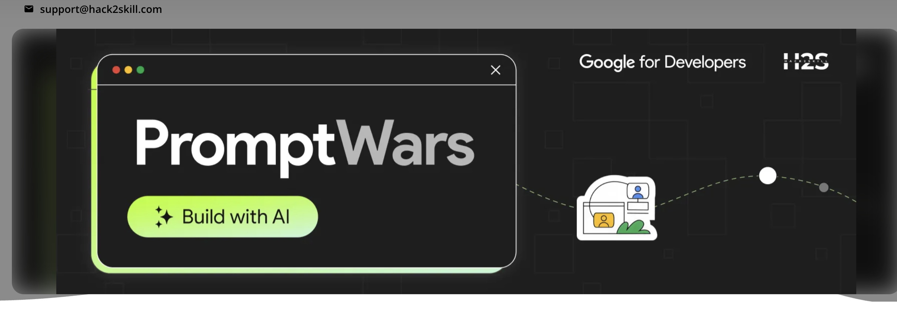
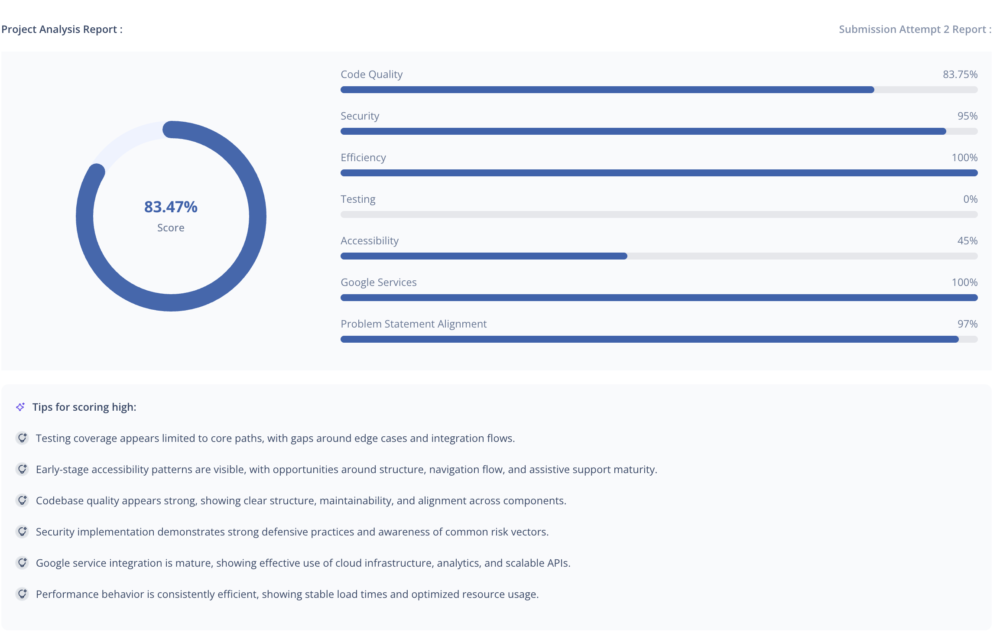

# EmoTrav — Vibe-Based AI Travel Planner



---

## Prompt Wars Hyderabad

**Prompt Wars** is an offline competitive AI-building event where participants solve a real-world problem statement using AI, ship a live product, and present it — all under time pressure.

### Event Details
- **Event:** Prompt Wars — Hyderabad Edition
- **Format:** Offline, live build + demo
- **Constraint:** Must use **Gemini AI** (google-genai SDK)

### Problem Statement
> *"Plan trips dynamically with preferences, constraints, and real-time updates."*

### My Solution
Build **EmoTrav** — a vibe-based emotional travel planner that generates day-wise itineraries personalised to how you *feel*, not just where you want to go. Hosted live on Google Cloud, streamed in real time via SSE, with a budget tracker and dynamic re-planning capability.

---

## The Solution: EmoTrav

EmoTrav turns a simple emotional vibe into a complete, day-by-day travel plan — then lets you adapt it on the fly.

### How It Works

```
Select your vibe  →  Pick city + duration + budget  →  AI generates day-wise itinerary
       ↓                                                          ↓
  Adventurous?                                         Real venues, coords, costs
  Healing?                                             streamed card by card
  Romantic?                                                      ↓
  Chaotic?                                             Budget breakdown live
                                                               ↓
                                                    Change plans? Re-plan dynamically
```

### Key Features

- **7 emotional vibes** — Romantic, Adventurous, Healing, Chaotic, Social, Slow, Creative
- **Spontaneity slider** — from fully planned (named venues every hour) to surprise-only (zone + mood, no venues)
- **8 curated cities** — Tokyo, Mumbai, Lisbon, Mexico City, Medellín, Cape Town, Melbourne, Dubai
- **Real-time SSE streaming** — day cards appear as they generate, no waiting for the full plan
- **Live budget panel** — per-day and per-category breakdown, on_track / near_limit / over_budget flags
- **Google Maps links** — every experience links directly to Maps coordinates
- **Dynamic adaptation** — re-plan any day based on weather, mood, or manual trigger

---

## Event Submission

| Rank | Analysis |
|------|----------|
|  |  |

---

## Architecture

Three AI agents run in a pipeline, the experience agents in parallel:

```
POST /trip/generate
        │
        ▼
OrchestratorAgent
        ├─ PlannerAgent       → 1 Gemini call → N day skeletons
        ├─ ExperienceAgent×N  → N parallel Gemini calls → fills each day
        └─ BudgetAgent        → pure Python → cost breakdown
                │
        SSE stream → frontend renders cards live
```

See [`_agentic_workflow.md`](./_agentic_workflow.md) for the full flow.

### Stack

| Layer | Technology |
|---|---|
| Frontend | Next.js 15 (App Router), Zustand, CSS Modules |
| Backend | FastAPI, Python 3.12 |
| AI | Gemini 2.5 Flash Lite (`google-genai` SDK) |
| Streaming | Server-Sent Events (SSE) |
| State | Zustand + sessionStorage persist |
| Hosting | GCP Cloud Run (both services) |
| CI/CD | GitHub Actions → Cloud Run source deploy |

---

## Live Demo

| Service | URL |
|---|---|
| Web App | https://emotrav-web-620175114461.us-central1.run.app |
| API | https://emotrav-api-620175114461.us-central1.run.app/health |

---

## Local Development

### API

```bash
cd apps/api
python -m venv .venv
source .venv/bin/activate
pip install -r requirements.txt

# Copy and fill in your keys
cp ../../.env.example .env

# Start (exports macOS system certs for SSL, then uvicorn)
bash start.sh
```

API runs at `http://localhost:8000`.

### Web

```bash
cd apps/web
npm install --legacy-peer-deps
npm run dev
```

Web runs at `http://localhost:3000`. Set `NEXT_PUBLIC_API_URL=http://localhost:8000` if needed.

---

## Deployment

Both services deploy automatically on push to `main` via GitHub Actions.

**Required GitHub secret:**

| Secret | Value |
|---|---|
| `GCP_SA_KEY` | Contents of GCP service account JSON key |

Manual deploy:

```bash
# API
gcloud run deploy emotrav-api \
  --source apps/api --region us-central1 \
  --project loki-warm-up-challenge \
  --set-secrets GOOGLE_API_KEY=emotrav-google-api-key:latest \
  --set-secrets GOOGLE_MAPS_API_KEY=emotrav-maps-api-key:latest

# Web
gcloud run deploy emotrav-web \
  --source apps/web --region us-central1 \
  --project loki-warm-up-challenge \
  --set-build-env-vars NEXT_PUBLIC_API_URL=https://emotrav-api-620175114461.us-central1.run.app
```

---

## Project Structure

```
.
├── apps/
│   ├── api/                        # FastAPI backend
│   │   ├── agents/
│   │   │   ├── orchestrator.py     # pipeline coordinator
│   │   │   ├── planner.py          # day skeleton agent
│   │   │   ├── experience.py       # experience fill agent
│   │   │   ├── budget.py           # deterministic budget calc
│   │   │   └── adaptation.py       # re-plan agent
│   │   ├── gemini.py               # shared Gemini client + JSON parser
│   │   ├── config.py               # city profiles, vibe/spontaneity blocks
│   │   ├── models/request.py       # Pydantic request models
│   │   ├── routers/trip.py         # SSE streaming endpoint
│   │   └── start.sh                # local dev start (SSL + uvicorn)
│   └── web/                        # Next.js 15 frontend
│       ├── app/
│       │   ├── page.tsx            # intent form (home)
│       │   └── workspace/page.tsx  # streaming itinerary view
│       ├── components/
│       │   ├── intent/             # vibe selector, form
│       │   └── workspace/          # day cards, budget panel
│       ├── store/index.ts          # Zustand store + all TS types
│       └── lib/api.ts              # SSE stream client
├── assets/                         # event photos
├── _agentic_workflow.md            # full agent pipeline diagram
├── prompt_engineering.md           # agent system prompts
└── .github/workflows/              # CI/CD — auto deploy on push to main
```

---

## Required API Keys

| Key | Where to get |
|---|---|
| `GOOGLE_API_KEY` | [Google AI Studio](https://aistudio.google.com/) — Gemini API |
| `GOOGLE_MAPS_API_KEY` | GCP Console → Maps JavaScript API (optional, for geocoding) |
